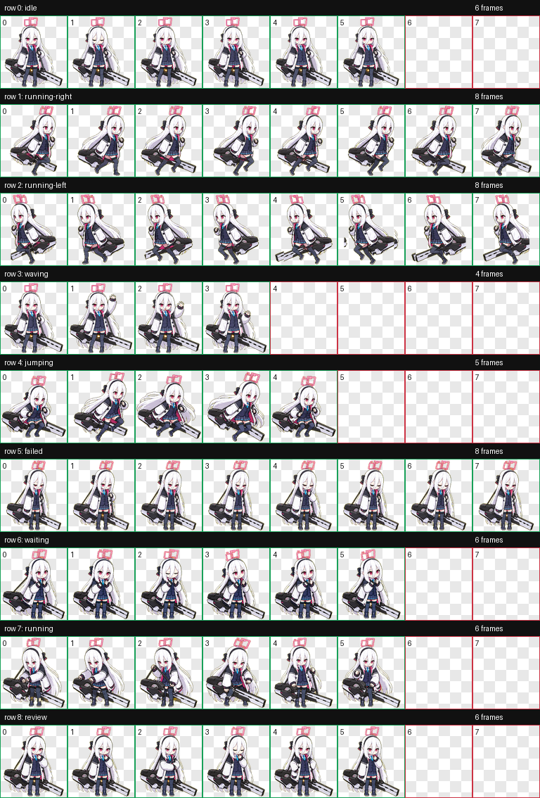

# Kei Codex 桌面宠物

Kei起初是天童爱丽丝的另一人格，由无名祭司所创造的AI，与爱丽丝共用一个身体，职责是指引“王女”AL-1S履行自身职责。

原本的名字是Key，在游戏开发部的误读中与埃利都事件后接受了“柯伊（Kei）”这个名字。

柯伊原本负责在AL-1S苏醒后使其转变为“无名诸神的王女”（启动器）。柯伊支配爱丽丝的身体时会变成紫红瞳。

如今早已成为独立个体的柯伊虽然属于超现象特务部，但还是基本呆在游戏开发部。

柯伊对爱丽丝会十分宠溺，也会常来打扫游戏开发部的活动室和给她们的游戏做QA（就是试玩，做质量保障）。


## 预览



## 安装方式

1. 下载或复制本仓库中的 `kei` 文件夹。
2. 将整个 `kei` 文件夹放入你的 Codex 宠物目录：

   ```text
   C:\Users\<你的用户名>\.codex\pets\
   ```

3. 放置完成后的路径应类似：

   ```text
   C:\Users\<你的用户名>\.codex\pets\kei\pet.json
   C:\Users\<你的用户名>\.codex\pets\kei\spritesheet.webp
   ```

4. 重新打开或刷新 Codex 的桌面宠物功能后，选择 `Kei` 即可使用。

## 文件结构

```text
kei/
  README.md
  pet.json
  spritesheet.webp
  preview.png
```

- `pet.json`：宠物元数据，包括名称、描述和图集路径。
- `spritesheet.webp`：桌宠动画图集，包含待机、左右移动、挥手、跳跃、失败、等待、处理中和审核等动作。
- `preview.png`：动作预览图。

## 版权说明

This is an unofficial fan-made desktop pet. Character rights belong to their respective owners.

本项目仅为非官方粉丝创作桌面宠物，用于个人学习、展示和非商业分享。原角色及相关权利归其各自权利方所有。
