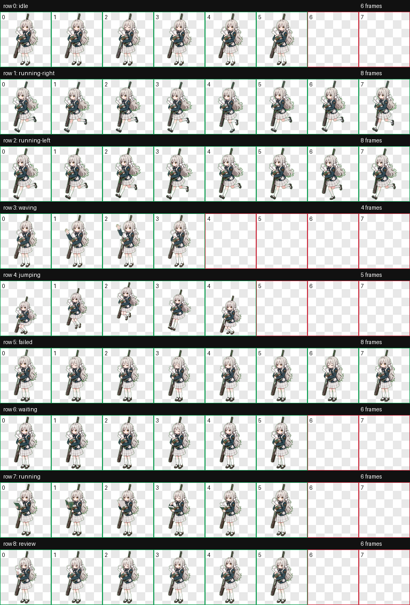

# Sakurai Miyo 桌面宠物

Sakurai Miyo 是狂猎艺术学院所属，非公认社团「特殊交易部」的部长。

目标是让特殊交易部解散。可惜因为性格胆小和部员们总是暴走的关系，想达成目标恐怕遥遥无期。

主修文学，在谋划方面有着极佳的天赋，有着涵盖全校的地下网络。

喜欢恋爱小说，也有在写恋爱小说。

和舍监队的裕美是好友，很受裕美信任，但也因此与她说话时总抱有负罪感。

了解老师在狂猎的所有行动，沉重发言频出，恐怖程度堪比米塔。考哥.jpg

一直在执着的想获得款式为“CuttieBerry87”的打字机，甚至为此被迫从事自己早已厌恶的“走私”工作。

美代的光环呈浅绿色，外部类似十字，内部包含一个四瓣花朵形图案。

## 预览



## 安装方式

1. 下载或复制本仓库中的 `sakurai-miyo` 文件夹。
2. 将整个 `sakurai-miyo` 文件夹放入你的 Codex 宠物目录：

   ```text
   C:\Users\<你的用户名>\.codex\pets\
   ```

3. 放置完成后的路径应类似：

   ```text
   C:\Users\<你的用户名>\.codex\pets\sakurai-miyo\pet.json
   C:\Users\<你的用户名>\.codex\pets\sakurai-miyo\spritesheet.webp
   ```

4. 重新打开或刷新 Codex 的桌面宠物功能后，选择 `Sakurai Miyo` 即可使用。

## 文件结构

```text
sakurai-miyo/
  README.md
  pet.json
  spritesheet.webp
  preview.png
```

- `pet.json`：宠物元数据，包括名称、描述和图集路径。
- `spritesheet.webp`：桌宠动画图集，包含待机、左右移动、挥手、跳跃、失败、等待、处理中和审核等动作。
- `preview.png`：动作预览图。

## 版权说明

This is an unofficial fan-made desktop pet. Character rights belong to their respective owners.

本项目仅为非官方粉丝创作桌面宠物，用于个人学习、展示和非商业分享。原角色及相关权利归其各自权利方所有。
