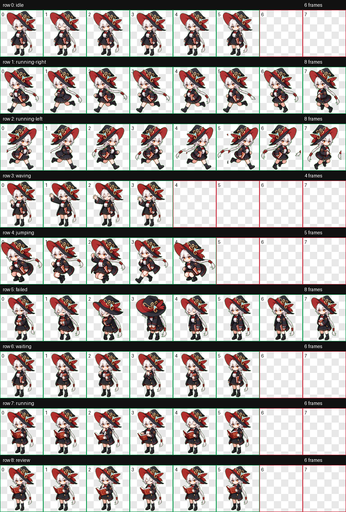

# Shirao Eri 桌面宠物

Shirao Eri 是狂猎艺术学院所属，研究艺术中蕴藏的神秘学的神秘学研究会会长。

总是戴着巨大的魔女帽，并将一切事物比喻为魔法来说话。深信能透过神秘学来提升自己有待加强的成绩。

从幼时便开始绘画，想要创作出《创世的影像》一样得到认可的作品。

因为画技不如同学而很少与同学玩，会保留过去的画作自己欣赏。

称呼老师为御者（Master）。

对摘掉自己的帽子十分抗拒。

占卜结果很准，在EX技能动画中使用的塔罗牌为“魔术师”。

绘里的光环呈淡金色，由三组图案中心分布，图案可以理解成一大一小互相嵌合的两个三曲腿图。

戴着帽子时光环位于帽子前方，摘下帽子后光环就移到脑后了。


## 预览



## 安装方式

1. 下载或复制本仓库中的 `shirao-eri` 文件夹。
2. 将整个 `shirao-eri` 文件夹放入你的 Codex 宠物目录：

   ```text
   C:\Users\<你的用户名>\.codex\pets\
   ```

3. 放置完成后的路径应类似：

   ```text
   C:\Users\<你的用户名>\.codex\pets\shirao-eri\pet.json
   C:\Users\<你的用户名>\.codex\pets\shirao-eri\spritesheet.webp
   ```

4. 重新打开或刷新 Codex 的桌面宠物功能后，选择 `Shirao Eri` 即可使用。

## 文件结构

```text
shirao-eri/
  README.md
  pet.json
  spritesheet.webp
  preview.png
```

- `pet.json`：宠物元数据，包括名称、描述和图集路径。
- `spritesheet.webp`：桌宠动画图集，包含待机、左右移动、挥手、跳跃、失败、等待、处理中和审核等动作。
- `preview.png`：动作预览图。

## 版权说明

This is an unofficial fan-made desktop pet. Character rights belong to their respective owners.

本项目仅为非官方粉丝创作桌面宠物，用于个人学习、展示和非商业分享。原角色及相关权利归其各自权利方所有。
