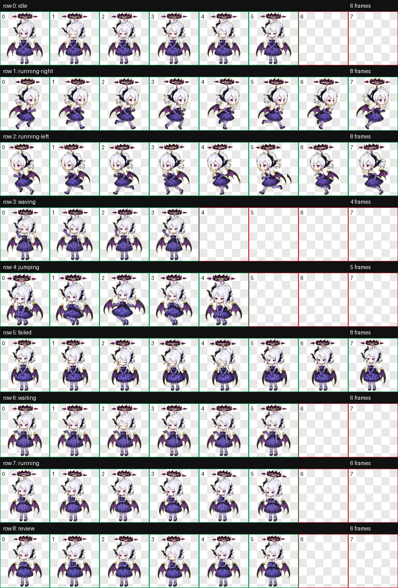

# Sorasaki Hina 桌面宠物

Sorasaki Hina 是格黑娜学园的风纪委员会长。
平常是觉得什么都很麻烦的懒虫少女，但是一旦在和校规有关的问题上，就会展现出严格的风纪委员长的样子。经常把“好麻烦”作为口头禅，但在战场上从不迷茫，快速判断并行动。因此与格黑娜敌对的组织最害怕她出场战斗。

阳奈的光环为三层同心圆，外层是上缘呈锯齿状的皇冠，两侧各延伸出一条尖刺，内层中间有个双锥。整体颜色为外层紫黑相间，中间层黑色，内层紫色。是少数光环具有垂直厚度的学生。

作为风纪委员会这样一个强大团队的领导者，阳奈看是一个非常沉着冷静的人。虽然经常忙于工作，但阳奈其实对许多任务感到厌烦。

在vol3.伊甸园条约篇中，对格黑娜大大小小事务感到精疲力尽的阳奈计划在条约顺利签订后退休，然而事与愿违。在第三章中老师到阳奈家中找到身着睡衣的她时，阳奈表示她无法像星野一样在目睹悲剧后仍然保持乐观、将生活继续下去。实际上，阳奈渴望得到老师的鼓励与安慰。


## 预览



## 安装方式

1. 下载或复制本仓库中的 `sorasaki-hina` 文件夹。
2. 将整个 `sorasaki-hina` 文件夹放入你的 Codex 宠物目录：

   ```text
   C:\Users\<你的用户名>\.codex\pets\
   ```

3. 放置完成后的路径应类似：

   ```text
   C:\Users\<你的用户名>\.codex\pets\sorasaki-hina\pet.json
   C:\Users\<你的用户名>\.codex\pets\sorasaki-hina\spritesheet.webp
   ```

4. 重新打开或刷新 Codex 的桌面宠物功能后，选择 `Sorasaki Hina` 即可使用。

## 文件结构

```text
sorasaki-hina/
  README.md
  pet.json
  spritesheet.webp
  preview.png
```

- `pet.json`：宠物元数据，包括名称、描述和图集路径。
- `spritesheet.webp`：桌宠动画图集，包含待机、左右移动、挥手、跳跃、失败、等待、处理中和审核等动作。
- `preview.png`：动作预览图。

## 版权说明

This is an unofficial fan-made desktop pet. Character rights belong to their respective owners.

本项目仅为非官方粉丝创作桌面宠物，用于个人学习、展示和非商业分享。原角色及相关权利归其各自权利方所有。
