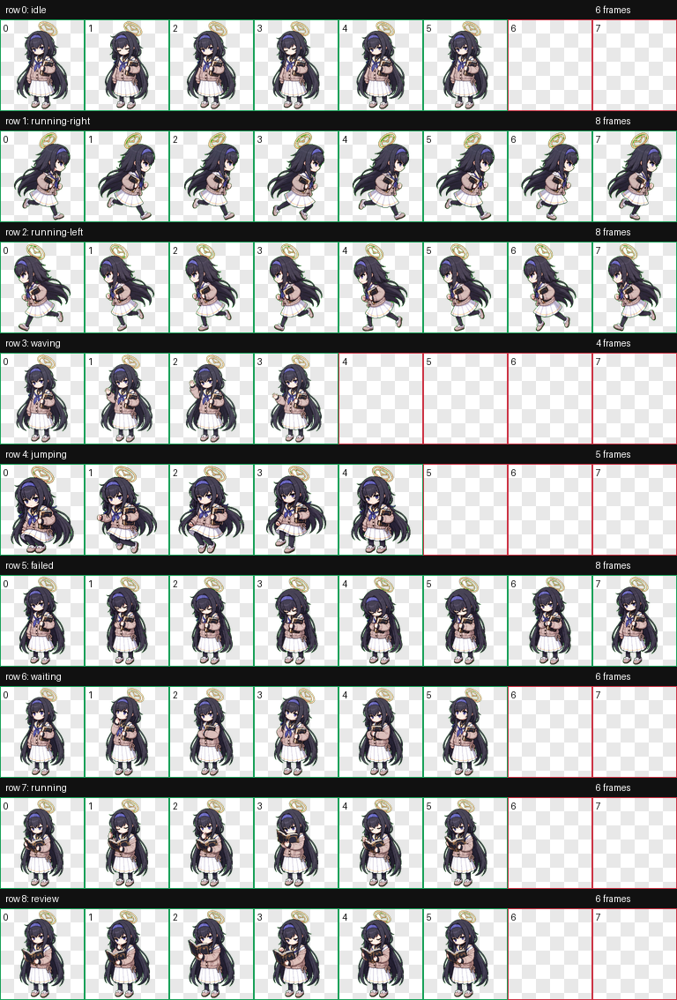

# Kozeki Ui 桌面宠物

Kozeki Ui 是三一综合学园下属，图书委员会的委员长。

深爱着书本的少女，同时也有些厌世。

在所有书籍中尤其喜欢古书，所以每天都是待在被称为“古书馆”的场所对古书进行解读和管理，过着隐居一般的日子。

因为她对知识的好奇心，以及对古书的知识和技术无人能及，被身边的人称作“古书馆的魔法师”


## 预览



## 安装方式

1. 下载或复制本仓库中的 `ui` 文件夹。
2. 将整个 `ui` 文件夹放入你的 Codex 宠物目录：

   ```text
   C:\Users\<你的用户名>\.codex\pets\
   ```

3. 放置完成后的路径应类似：

   ```text
   C:\Users\<你的用户名>\.codex\pets\ui\pet.json
   C:\Users\<你的用户名>\.codex\pets\ui\spritesheet.webp
   ```

4. 重新打开或刷新 Codex 的桌面宠物功能后，选择 `Kozeki Ui` 即可使用。

## 文件结构

```text
ui/
  README.md
  pet.json
  spritesheet.webp
  preview.png
```

- `pet.json`：宠物元数据，包括名称、描述和图集路径。
- `spritesheet.webp`：桌宠动画图集，包含待机、左右移动、挥手、跳跃、失败、等待、处理中和审核等动作。
- `preview.png`：动作预览图。

## 版权说明

This is an unofficial fan-made desktop pet. Character rights belong to their respective owners.

本项目仅为非官方粉丝创作桌面宠物，用于个人学习、展示和非商业分享。原角色及相关权利归其各自权利方所有。
